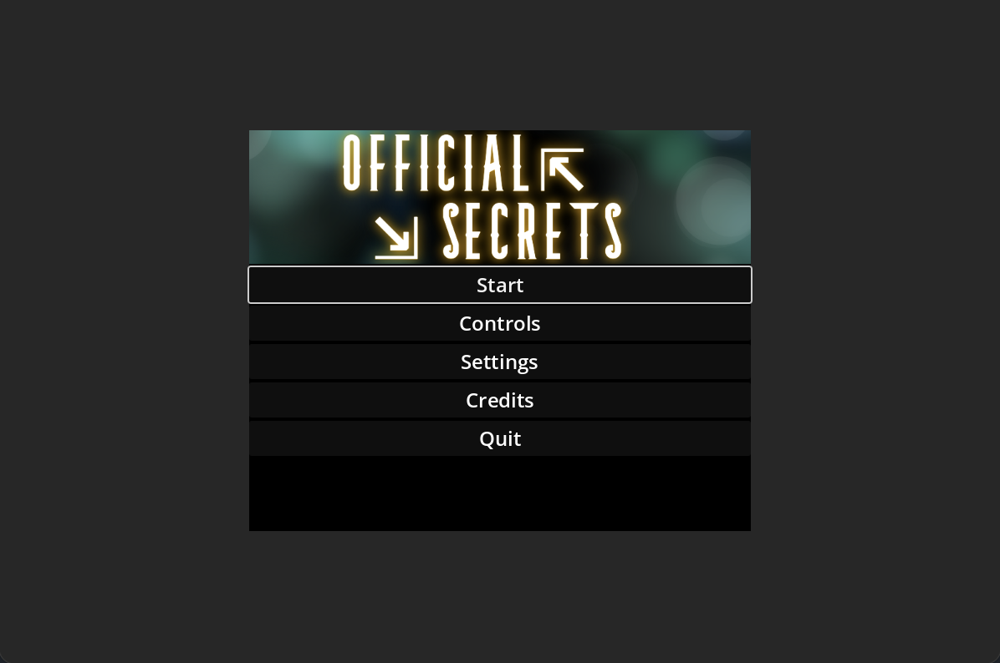
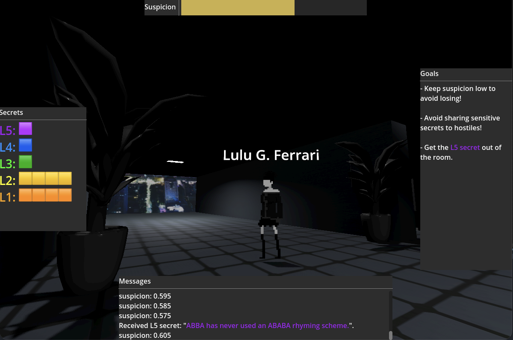
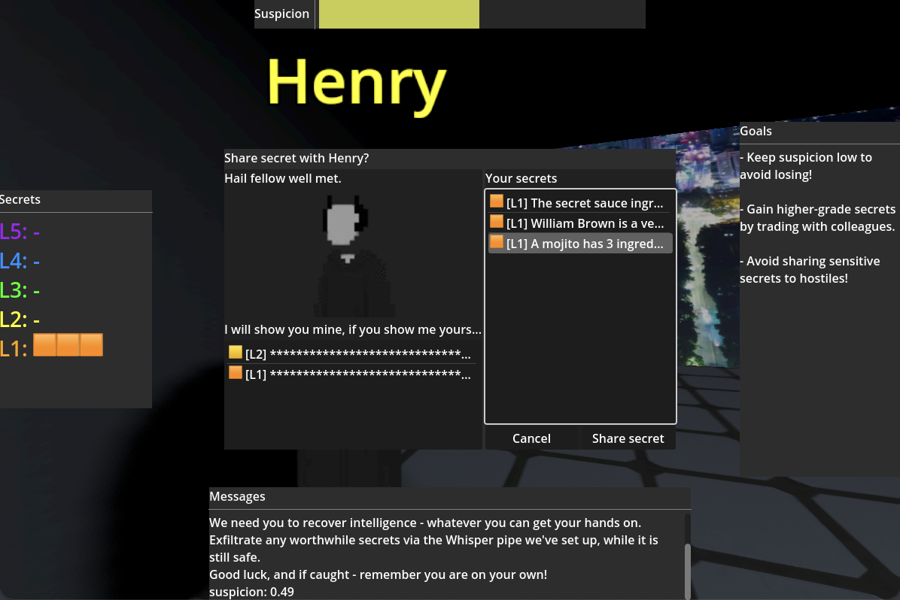
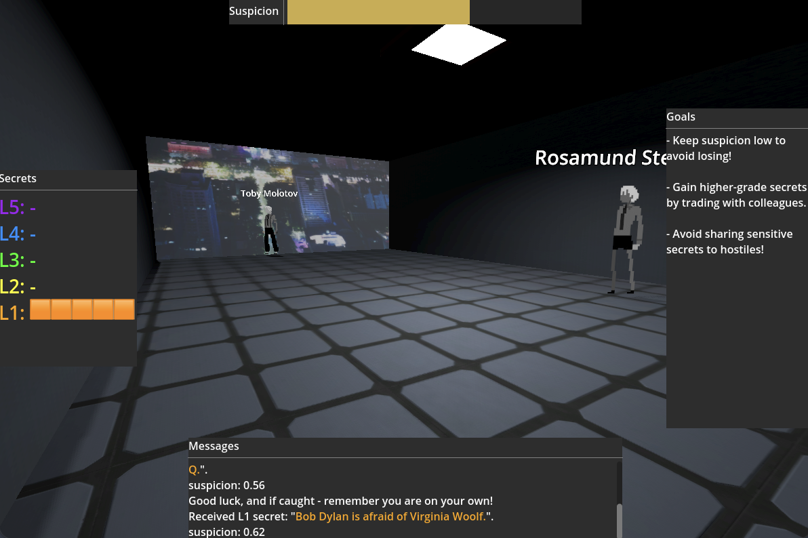

# godot-official-secrets

This is a short one-level game about smuggling secrets, created with [Godot 4.3](https://godotengine.org/) for [Github Game-Off Jam 2024](https://resources.github.com/events/game-off-2024/) (*jam theme: __secrets__*).

The aim of the game is to find out secret information from colleagues in a dystopian government agency office building, and exfiltrate it to your handler. If the agency's suspicion of you rises too high, the game is lost.

## Play

The game is playable online at https://mn3monic.itch.io/official-secrets

Some screenshots:

   

## Licence

The code in this Godot game project is an original work, protected by copyright, and is not licensed for commercial or private re-use.

However all of the sprites, models, textures, sounds and music are "shareware" (free, found) assets with permissive licences, and can be traced to their sources by [./assets/bom.txt](./assets/bom.txt).
